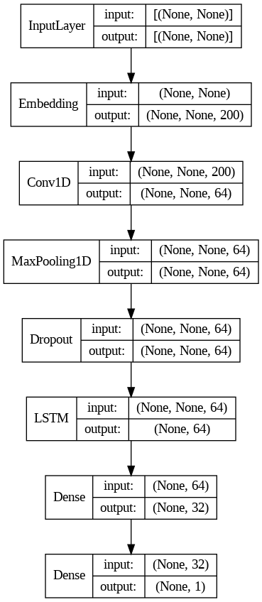
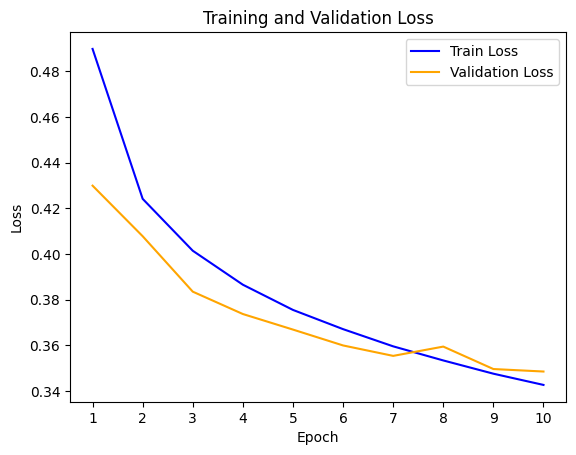

# GloVe-enhanced CNN

## Model Architecture
The GloVe-enhanced CNN model comprises seven layers:

1. **Embedding Layer**: Converts input text into vectors using [pre-trained GloVe embeddings](https://nlp.stanford.edu/projects/glove/).
2. **Convolutional Layer**: Extracts local features through sliding windows.
3. **Global Max-pooling Layer**: Reduces feature dimensionality.
4. **Dropout Layer**: Deactivates 20% of input units during training to prevent overfitting.
5. **LSTM Layer**: Learns long-term dependencies in sequential data.
6. **Dense Layer (1)**: Performs nonlinear transformations on input data.
7. **Dense Layer (2)**: Uses sigmoid activation to map output into a probability of belonging to the positive class.

The model employs stochastic gradient descent optimizer with binary cross-entropy loss function.

## Training & Overfitting

The GloVe-enhanced CNN was trained over 10 epochs with a batch size of 32. Overfitting was mitigated by reducing model complexity and adding dropout. However, overfitting occurred after the seventh epoch.

### Training Metrics (Epochs 1-10):

| Epoch | Accuracy | Precision | Recall | F1 Score |
|-------|----------|-----------|--------|----------|
| 1     | 75.99    | 73.81     | 80.78  | 76.37    |
| 2     | 80.39    | 78.71     | 83.48  | 80.49    |
| 3     | 81.56    | 79.91     | 84.48  | 81.63    |
| 4     | 82.33    | 80.73     | 85.09  | 82.37    |
| 5     | 82.90    | 81.37     | 85.48  | 82.91    |
| 6     | 83.35    | 81.87     | 85.80  | 83.32    |
| 7     | 83.73    | 82.30     | 86.07  | 83.68    |
| 8     | 84.08    | 82.67     | 86.34  | 84.03    |
| 9     | 84.31    | 82.93     | 86.53  | 84.26    |
| 10    | 84.55    | 83.25     | 86.64  | 84.48    |

### Validation Metrics (Epochs 1-10):

| Epoch | Accuracy | Precision | Recall | F1 Score |
|-------|----------|-----------|--------|----------|
| 1     | 80.22    | 79.01     | 82.73  | 80.36    |
| 2     | 81.39    | 82.16     | 80.55  | 80.85    |
| 3     | 82.52    | 79.87     | 87.31  | 83.01    |
| 4     | 83.18    | 80.52     | 87.87  | 83.63    |
| 5     | 83.40    | 81.40     | 86.92  | 83.66    |
| 6     | 83.72    | 82.66     | 85.67  | 83.71    |
| 7     | 84.01    | 83.03     | 85.79  | 83.96    |
| 8     | 83.72    | 79.26     | 91.68  | 84.64    |
| 9     | 84.16    | 82.26     | 87.43  | 84.35    |
| 10    | 84.25    | 84.61     | 84.02  | 83.89    |

### Loss CurveOver Ten Epochs:

